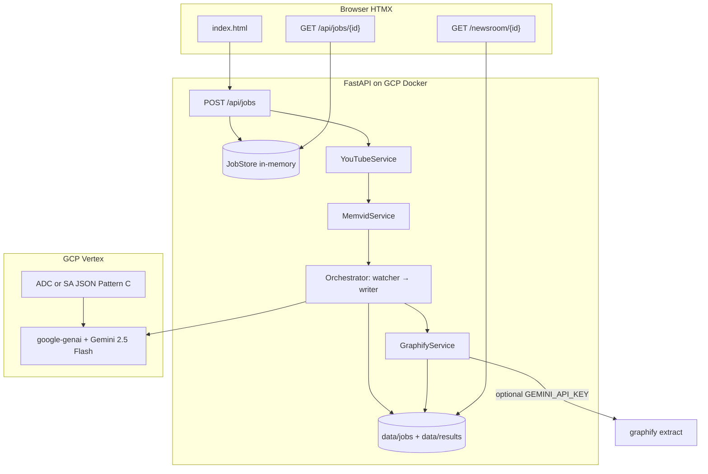

# Project Specification: The Multimodal Newsroom

## 1. Project Overview & Vision

**Concept:** "The Multimodal Newsroom" is an automated, AI-driven content generation pipeline designed for rapid media deployment. It takes a video of an event (e.g., a SpaceX launch, a sports highlight, a keynote speech)—provided as a **YouTube URL**—and autonomously transforms it into a comprehensive multimedia press kit.

**Marketing tagline:** **~60 seconds** to a full press kit (applies to **Quick mode** after the selected video window is ingested; see §3.3). **Full mode** may take **up to an hour or less** depending on video length (max **1 hour** of source video).

**Final output:**
- A polished Markdown blog post (rendered to HTML)
- An engaging **3-part Twitter thread**
- An interactive **knowledge graph** (entities and relationships), rendered with **D3.js** in the browser

**Deployment:** Public URL on **GCP** (single VM + Docker). Demo narrative may describe a **CrewAI-style two-agent pipeline**; implementation uses a **thin Python orchestrator** (not the CrewAI library) unless explicitly added later.

---

## 2. Locked Design Decisions

| Area | Decision |
|------|----------|
| **Source of truth** | **This spec** over any standalone HTML mock behavior. Static HTML/Stitch mocks are **visual design references only** — ported into Jinja/Tailwind, not alternate API or pipeline behavior. |
| Job execution | **Async in-memory jobs** + HTMX polling (`POST /api/jobs`, `GET /api/jobs/{id}` every ~2s) — not one blocking POST |
| Video input | **YouTube URL only** (v1) — no MP4 upload UI |
| Results | Shareable **`/newsroom/{id}`**; homepage lists past runs from `data/results/` |
| Processing modes | **Quick** (default) vs **Full** — see §4 |
| LLM (Watcher/Writer) | **Gemini 2.5 Flash** via **`google-genai`** SDK with **`vertexai=True`** (Vertex backend). **Not** the legacy `google-cloud-aiplatform`–only call path. |
| LLM output | **Pydantic structured output** for Writer (`WriterOutput`); Watcher uses `generate_text` |
| GCP auth | **Pattern C** — ADC locally (`gcloud auth application-default login`, **no** `GOOGLE_APPLICATION_CREDENTIALS`); service account JSON in Docker at `secrets/gcp-sa.json` → `/secrets/gcp.json` |
| Video context | **Real yt-dlp + ffmpeg** download/trim; **Memvid CLI/SDK** (`memvid put`, Whisper + visual search) → `unified_context` |
| Agent orchestration | **Thin `PipelineRunner`** — `WatcherAgent` → `WriterAgent`; pitch as CrewAI-style, no CrewAI library |
| Mapper | **`GraphifyService`** — subprocess `graphify extract` when LLM keys available; **heuristic** graph fallback otherwise |
| Graph UI | **D3.js** (`app/static/js/graph.js`) — `graph.json` embedded in `newsroom.html` |
| Mock modes | See §10.1 — `MOCK_LLM` / missing GCP vs `PRESSPLAY_USE_MOCK=1` |
| Auth (v1) | **None by default**; optional **`PRESSPLAY_DEMO_SECRET`** |
| Rate limits | **~5 jobs / hour / IP**; **max 2 concurrent** jobs (**locked** for v1; see §17) |
| Full mode cap | **1 hour** max source video length |

---

## 3. Technology Stack

| Layer | Choice | Notes |
|-------|--------|-------|
| Backend | **FastAPI** (Python) | Async-capable; single process + background tasks |
| Frontend | **HTML5, Jinja2, Tailwind CDN, HTMX** | No frontend build step for hackathon |
| Video download | **yt-dlp** | YouTube-only URL validation; trim for Quick mode |
| Vision / context | **Memvid Python SDK** (local) | Whisper transcript + frame/visual context → unified text payload |
| LLM | **`google-genai`** → **Vertex** (`genai.Client(vertexai=True, ...)`) | `app/adapters/gemini.py`; model default `gemini-2.5-flash` |
| Orchestration | **Thin Python pipeline** | `app/services/pipeline.py`: Watcher → Writer → Graphify |
| Knowledge graph | **`graphifyy` pip package**, CLI binary **`graphify`** (also checks `graphifyy`) | `graphify extract <dir> --backend gemini --no-cluster --out <dir>`; reads `graphify-out/graph.json` |
| Graph visualization | **D3.js** | Force-directed graph from normalized JSON |
| Hosting | **GCP Compute Engine (or similar) + Docker** | Public HTTPS; `data/` volume for results and temp files |

**Explicitly not in v1:** CrewAI library, MP4 file upload, Pyvis server-rendered graphs, serverless-only hosting without a worker VM.

---

## 4. Processing Modes

### 4.1 Quick (default)

- Processes a **5–20 minute** window of the YouTube video (default **10 minutes**; configurable via form or env).
- Server **enforces** the window (do not rely on the client).
- Target: press kit in **~60 seconds** after Memvid ingest completes for typical clips (marketing tagline).
- Best for live demos and judges.

### 4.2 Full

- Processes up to **1 hour** of source video.
- Staged progress UI; copy: **“may take up to an hour or less.”**
- No 60-second SLA claim.

### 4.3 Mode selection (UI)

- Form fields: **YouTube URL**, **mode** (`quick` \| `full`), optional **quick_minutes** (5–20), optional **demo secret** (if env set).
- HTMX submits to `POST /api/jobs`; polls until `done`, then links to **`/newsroom/{id}`**.

---

## 5. System Architecture & Data Flow



### 5.1 Pipeline steps

1. **Ingestion:** User submits YouTube URL + mode on index. HTMX `POST /api/jobs` creates job; progress partial polls until `done`.
2. **Download:** `YouTubeService` validates YouTube URL, downloads via **yt-dlp**, trims with **ffmpeg** (Quick window or Full up to 1h). Skipped when `PRESSPLAY_USE_MOCK=1`.
3. **Context extraction:** `MemvidService` runs **`memvid put`** on local file → **unified_context** (Whisper transcript + visual search snippets). Temp video deleted after ingest. Full mock uses `extract_context_stub`.
4. **Watcher:** `WatcherAgent` → `GeminiAdapter.generate_text` on Vertex (or canned mock).
5. **Writer:** `WriterAgent` → `GeminiAdapter.generate_structured(..., WriterOutput)` (or mock JSON).
6. **Mapper:** `GraphifyService.build_graph` — `graphify extract` + normalize, or heuristic fallback → D3 `graph.json`.
7. **Persistence:** `ResultsRepository.save` → `data/results/{id}/`; `result_url` `/newsroom/{id}`.

### 5.2 Job state machine

```text
queued → downloading → memvid → watching → writing → mapping → done
                                                              ↘ failed
```

Expose via `GET /api/jobs/{id}` for HTMX polling (e.g. every 2s):

```json
{
  "id": "uuid",
  "status": "writing",
  "stage": "writing",
  "progress_pct": 65,
  "mode": "quick",
  "youtube_url": "https://...",
  "error": null,
  "result_url": "/newsroom/uuid"
}
```

### 5.3 Implementation status (hackathon build)

| Component | Status | Notes |
|-----------|--------|--------|
| FastAPI + Jinja + HTMX + Tailwind CDN | **Shipped** | `app/main.py`, templates under `app/templates/` |
| `POST /api/jobs` + poll + `/newsroom/{id}` | **Shipped** | Matches locked API surface |
| `GET /health` | **Shipped** | Liveness for Docker/VM |
| YouTubeService (yt-dlp, Quick trim) | **Shipped** | Real unless `PRESSPLAY_USE_MOCK=1` |
| MemvidService (CLI ingest) | **Shipped** | Requires local `memvid` + Whisper models; see blockers §17 |
| WatcherAgent / WriterAgent | **Shipped** | Vertex when GCP configured; canned SpaceX stub when `should_mock_llm()` |
| GraphifyService | **Shipped** | CLI when keys + binary present; heuristic/stub fallback |
| D3 newsroom graph | **Shipped** | `app/static/js/graph.js` |
| JobStore + rate limit + concurrent cap (2) | **Shipped** | `app/api/deps.py` |
| ResultsRepository + past runs on `/` | **Shipped** | `manifest.json` includes pipeline/LLM mock flags |
| GCP production deploy | **Not done** | Docker image + compose ready; VM deploy TBD |
| `run.sh` local launcher | **Shipped** | Requires `GCP_PROJECT_ID` for live Vertex path; see §12.1 |

---

## 6. Backend Design Patterns

| Pattern | Where | Purpose |
|---------|--------|---------|
| **Layered / hexagonal** | `api/` → `services/` → `adapters/` | Isolate Memvid, Graphify, Gemini from routes |
| **Job + state machine** | `JobStore` + status enum | HTMX polling and staged UI |
| **Pipeline** | `PipelineRunner` | Ordered steps with shared job context |
| **Adapter** | `GeminiAdapter` (`app/adapters/gemini.py`); Memvid/Graphify as services | Swappable external tools |
| **Mock policy** | `app/services/mock_mode.py` | Central `should_mock_llm()`, `pipeline_skips_ingest()`, Graphify heuristic |
| **DTO / Pydantic** | `PressKitResult`, `WriterOutput`, etc. | Strict JSON contracts |
| **Repository (light)** | `ResultsRepository` | Filesystem persistence for `/newsroom/{id}` |
| **Strategy** | `ProcessingMode.QUICK` \| `FULL` | Different download trim and timeouts |
| **Facade** | `NewsroomService` | Single entry from API routes |

**The Mapper** is implemented as **`GraphifyService`** (subprocess or Python API), not a third LLM-based CrewAI agent. It remains **“Agent 3 (The Mapper)”** in product language.

---

## 7. Agent Specifications

### 7.1 The Watcher (implementation: `app/services/agents/watcher.py`)

- **Role:** Video Context Analyst
- **Input:** Memvid `unified_context` string
- **Goal:** Chronological, factual summary of the event
- **Persona (prompt):** Meticulous investigative journalist
- **Implementation:** `GeminiAdapter.generate_text` (Vertex `google-genai` or mock stub)

### 7.2 The Writer (implementation: `app/services/agents/writer.py`)

- **Role:** Lead Copywriter & Social Media Manager
- **Input:** Watcher summary
- **Goal:** Markdown blog post + cohesive 3-part Twitter thread
- **Persona (prompt):** Expert digital marketer and storyteller
- **Implementation:** `GeminiAdapter.generate_structured` with Pydantic `WriterOutput` (`response_schema` / JSON mode on Vertex)
- **Output contract (Pydantic):**

```json
{
  "blog_post": "# Title\n\n...",
  "tweets": ["tweet 1", "tweet 2", "tweet 3"]
}
```

### 7.3 The Mapper (implementation: `app/services/graphify.py`)

- **Role:** Knowledge Graph Architect (service, not LLM agent)
- **Input:** Final `blog_post` markdown (written to temp dir as `blog.md`)
- **Tool:** Graphify CLI — package **`graphifyy`**, executable **`graphify`** (fallback name `graphifyy`; override via `GRAPHIFY_BIN`)
- **Command:** `graphify extract <work_dir> --no-cluster --out <work_dir> [--backend gemini]` when `graphify_llm_available()`; output at `graphify-out/graph.json`
- **Auth gap:** PressPlay Watcher/Writer use **Vertex via `google-genai` + ADC/SA**. Graphify CLI semantic extract typically needs **`GEMINI_API_KEY`** (or other vendor keys in env). Vertex SA alone may not satisfy the CLI — heuristic graph used when keys missing or `should_mock_llm()`
- **Fallback:** Regex/heuristic graph from markdown headings, bold, caps; fixed SpaceX stub if too sparse
- **Output contract (normalized for D3):**

```json
{
  "nodes": [
    { "id": "spacex", "label": "SpaceX", "group": "org" }
  ],
  "edges": [
    { "source": "spacex", "target": "falcon9", "label": "launched" }
  ]
}
```

Graphify’s native `graph.json` is adapted to this shape in a small Python mapper.

---

## 8. API Surface

| Method | Path | Purpose |
|--------|------|---------|
| `GET` | `/` | Form + list of recent press kits from `data/results/` |
| `POST` | `/api/jobs` | Create job (HTMX); returns progress partial |
| `GET` | `/api/jobs/{id}` | Poll status / stage (HTMX `every 2s`) |
| `GET` | `/newsroom/{id}` | Shareable results: blog, tweets, D3 graph |
| `GET` | `/health` | Liveness `{"status":"ok"}` |

**POST form fields:** `youtube_url`, `mode` (`quick` \| `full`), optional `quick_minutes` (5–20), optional `secret` (required when `PRESSPLAY_DEMO_SECRET` is set).

---

## 9. Repository Layout

```text
pressplay/
├── run.sh                        # local deps + ADC/SA checks; optional --verify-llm
├── Dockerfile
├── docker-compose.yml
├── requirements.txt
├── .env.example
├── README.md
├── app/
│   ├── main.py
│   ├── config.py                 # Settings, Pattern C credential mode
│   ├── api/
│   │   ├── routes_pages.py
│   │   ├── routes_jobs.py
│   │   └── deps.py               # rate limit, concurrent cap, demo secret
│   ├── domain/
│   │   ├── models.py
│   │   └── errors.py
│   ├── adapters/
│   │   └── gemini.py             # google-genai Vertex + mock stubs
│   ├── services/
│   │   ├── mock_mode.py          # ingest skip vs LLM mock vs Graphify heuristic
│   │   ├── job_store.py
│   │   ├── pipeline.py
│   │   ├── youtube.py
│   │   ├── memvid.py
│   │   ├── graphify.py
│   │   ├── results_repo.py
│   │   └── agents/
│   │       ├── watcher.py
│   │       └── writer.py
│   ├── static/js/graph.js
│   └── templates/                # Jinja; visual tokens from HTML mock design
│       ├── base.html
│       ├── index.html
│       ├── newsroom.html
│       └── partials/
│           ├── job_progress.html
│           └── job_error.html
├── data/                         # Docker volume
│   ├── jobs/
│   └── results/{id}/
│       ├── manifest.json         # includes pipeline_mock, llm_mock labels
│       ├── blog.md
│       ├── tweets.json
│       ├── graph.json
│       └── summary.txt
├── secrets/                      # gitignored — gcp-sa.json for Docker
└── scripts/
    ├── verify_gcp.py             # Vertex smoke via GeminiAdapter
    └── cleanup_ttl.py            # optional cron TTL for data/results/
```

---

## 10. Configuration Defaults

| Setting | Default | Notes |
|---------|---------|-------|
| `GCP_PROJECT_ID` | *(empty)* | Preferred; `VERTEX_PROJECT` alias. Unset → auto **mock LLM** (ingest still real unless full mock) |
| `GCP_LOCATION` | `us-central1` | `VERTEX_LOCATION` alias |
| `GEMINI_MODEL` | `gemini-2.5-flash` | Vertex model id for Watcher/Writer |
| `GOOGLE_APPLICATION_CREDENTIALS` | *(unset locally)* | **Docker/VM only:** `/secrets/gcp.json` from `secrets/gcp-sa.json` mount |
| `MOCK_LLM` | `false` | `true` → stub Watcher/Writer; **real** yt-dlp + Memvid |
| `PRESSPLAY_USE_MOCK` | *(empty)* | `1` → **full fast mock** (skip ingest); `0` → force real ingest even without GCP |
| `MAX_CONCURRENT_JOBS` | `2` | **Locked** for v1 |
| `RATE_LIMIT_PER_HOUR` | `5` | Per client IP |
| `QUICK_MINUTES_DEFAULT` | `10` | Allowed range 5–20 |
| `QUICK_MINUTES_MIN` / `MAX` | `5` / `20` | Server-enforced |
| `FULL_MAX_VIDEO_SECONDS` | `3600` | 1 hour |
| `RESULTS_TTL_HOURS` | `72` | `scripts/cleanup_ttl.py` |
| `PRESSPLAY_DEMO_SECRET` | *(unset)* | Optional shared-secret gate |
| `GRAPHIFY_BIN` | *(auto)* | Override path to `graphify` binary |
| `GEMINI_API_KEY` | *(optional)* | For Graphify CLI `--backend gemini`; not required for Vertex Watcher/Writer |

**Optional auth:** If `PRESSPLAY_DEMO_SECRET` is set, require matching form field `secret` or `X-PressPlay-Secret` header. If unset, no auth.

### 10.1 Mock & demo modes (implemented)

Central logic: `app/services/mock_mode.py`.

| Mode | Env | Ingest (yt-dlp + Memvid) | Watcher / Writer | Graph |
|------|-----|--------------------------|------------------|-------|
| **Default without GCP** | `GCP_PROJECT_ID` unset, `PRESSPLAY_USE_MOCK` unset | **Real** | Mock (canned via `GeminiAdapter`) | Heuristic |
| **Mock LLM** | `MOCK_LLM=true` | **Real** | Mock | Heuristic |
| **Full fast mock** | `PRESSPLAY_USE_MOCK=1` | **Skipped** (stub context) | Mock | Heuristic |
| **Force real ingest** | `PRESSPLAY_USE_MOCK=0` | **Real** even if GCP unset | Per GCP / `MOCK_LLM` | Per keys |
| **Live pipeline** | `GCP_PROJECT_ID` + ADC or SA, mocks off | **Real** | **Vertex** (`google-genai`) | Graphify CLI when keys + binary; else heuristic |

**Verify live Vertex:** `./run.sh --verify-llm` → `scripts/verify_gcp.py` (fails if `should_mock_llm()`).

---

## 10.2 Local development tooling

| Tool | Purpose |
|------|---------|
| **`./run.sh`** | Creates/uses `.venv`, installs `requirements.txt`, checks `ffmpeg`, `yt-dlp`, warns on missing `memvid`/`graphify`, loads `.env`, validates **Pattern C** ADC or SA file, optional `--verify-llm`, starts `uvicorn --reload`. **Requires `GCP_PROJECT_ID`** for startup (live Vertex workflow). |
| **`./run.sh --skip-server`** | Checks only |
| **`scripts/verify_gcp.py`** | One-shot Vertex `generate_text` smoke test |
| **`scripts/cleanup_ttl.py`** | Delete `data/results/*` older than `RESULTS_TTL_HOURS` |
| **Manual / mock demo** | `uvicorn app.main:app --reload` without `run.sh` when GCP unset or using `PRESSPLAY_USE_MOCK=1` |

See `README.md` for command examples.

---

## 11. Guardrails & Error Handling

- **YouTube only** — reject non-YouTube URLs; handle private/unavailable/live-not-ready with clear HTMX error partials.
- **Concurrent cap** — max 2 active pipelines.
- **Rate limit** — ~5 job creations per hour per IP.
- **Quick mode** — server-side enforce 5–20 minute processing window.
- **Full mode** — max 1 hour of source video; staged progress, no 60s claim.
- **Playlists** — not supported in v1 unless explicitly added later.
- **Temp files** — delete YouTube downloads after Memvid; TTL cleanup for old `data/results/`.

---

## 12. GCP & Docker Deployment

| Component | Recommendation |
|-----------|----------------|
| VM | e.g. **e2-standard-4** (4 vCPU, 16GB RAM) for Memvid/Whisper |
| Disk | 50–100GB boot + volume mount for `data/` |
| Image | `Dockerfile`: Python 3.11-slim, `ffmpeg`, pip deps from `requirements.txt` (`google-genai`, `graphifyy`, `memvid-sdk`, …) |
| Secrets | `secrets/gcp-sa.json` → mount `/secrets/gcp.json`; `GOOGLE_APPLICATION_CREDENTIALS=/secrets/gcp.json` |
| HTTPS | Reverse proxy (Caddy/nginx) or GCP load balancer → container `:8000` |
| Egress | Outbound HTTPS for YouTube, Vertex |

### 12.1 GCP auth — Pattern C (locked)

| Environment | Credentials | Configuration |
|-------------|-------------|-----------------|
| **Local dev** | [Application Default Credentials](https://cloud.google.com/docs/authentication/application-default-credentials) | `gcloud auth application-default login`; set `GCP_PROJECT_ID`, `GCP_LOCATION`; **leave `GOOGLE_APPLICATION_CREDENTIALS` unset** |
| **Docker / GCP VM** | Service account JSON | Mount `./secrets/gcp-sa.json:/secrets/gcp.json:ro`; compose sets `GOOGLE_APPLICATION_CREDENTIALS=/secrets/gcp.json` |

`GeminiAdapter` uses `google.genai.Client(vertexai=True, project=..., location=...)`. Startup logs `Gemini auth mode: adc | service_account | mock`.

**Implemented `docker-compose.yml`:**

```yaml
services:
  newsroom:
    build: .
    ports: ["8000:8000"]
    volumes:
      - ./data:/app/data
      - ./secrets/gcp-sa.json:/secrets/gcp.json:ro
    env_file: [.env]
    environment:
      GOOGLE_APPLICATION_CREDENTIALS: /secrets/gcp.json
      GCP_PROJECT_ID: ${GCP_PROJECT_ID:-${VERTEX_PROJECT}}
      GCP_LOCATION: ${GCP_LOCATION:-${VERTEX_LOCATION:-us-central1}}
```

**Memvid shipping:** `memvid-sdk` is in `requirements.txt`; Whisper models (`memvid models install whisper-small`) and runtime ingest still require operator setup on host or image build step — see §17.

---

## 13. Frontend

**Design source:** Stitch/HTML mock tokens (colors, typography, spacing) ported into **`app/templates/base.html`** and child templates. Mock pages do **not** define API routes, job flow, or pipeline behavior — **spec §2 and §8 win**.

### 13.1 Index (`index.html`)

- YouTube URL input
- Mode toggle: **Quick** / **Full**
- Quick mode: duration control (**5–20 min**, default 10)
- Submit → HTMX `hx-post="/api/jobs"` → `partials/job_progress.html`
- Poll `GET /api/jobs/{id}` (`hx-trigger="every 2s"`) until `done` → link to `/newsroom/{id}`
- **Past runs** from `ResultsRepository.list_recent()`

### 13.2 Newsroom (`newsroom.html`)

- Blog: Markdown → HTML (server-side `markdown` library)
- Three tweet cards + copy-to-clipboard
- D3 force graph: `graph.json` in `<script type="application/json" id="graph-data">` + `/static/js/graph.js`

### 13.3 Chrome / navigation

- Top nav in `base.html` (**Dashboard**, Sources, Analytics) is **decorative** for hackathon polish — only **Dashboard** (`/`) is wired. Sources/Analytics are non-functional placeholders unless added post-v1.

---

## 14. Hackathon Execution Plan (checklist)

| Step | Scope | Status |
|------|--------|--------|
| 1 Foundation | FastAPI, Jinja, Tailwind CDN, HTMX, `POST/GET /api/jobs`, JobStore, index + progress partials, Docker compose, `.env.example`, `run.sh` | **Done** |
| 2 Eyes & Ears | `YouTubeService`, `MemvidService`, pipeline `downloading` → `memvid` | **Done** (Memvid runtime install still operator-dependent) |
| 3 Brains | `GeminiAdapter` (`google-genai` Vertex), `WatcherAgent`, `WriterAgent` + Pydantic, mock modes | **Done** |
| 4 Mapper | `GraphifyService` (`graphify extract` + heuristic), D3 `graph.js`, `mapping` stage | **Done** |
| 5 Paint | `ResultsRepository`, `/newsroom/{id}`, past runs, error partials, rate limit, concurrent cap=2 | **Done** |
| 6 Deploy | GCP VM, HTTPS, public smoke test | **Not done** |

---

## 15. Persisted Result Artifacts

Per job `data/results/{id}/`:

| File | Content |
|------|---------|
| `manifest.json` | id, youtube_url, mode, title, created_at, `pipeline_mock`, `llm_mock`, pipeline label |
| `blog.md` | Markdown blog post |
| `tweets.json` | Array of 3 tweets |
| `graph.json` | D3-ready nodes/edges |
| `summary.txt` | Watcher summary (optional, for debugging) |

---

## 16. Out of Scope (v1)

- MP4 file upload UI
- CrewAI / LangGraph library integration
- User accounts / OAuth
- Cloud SQL / Postgres
- Graphify HTML visualization (using D3 only)
- Playlist / multi-video batch processing
- Serverless-only deployment without a persistent worker VM

---

## 17. Open Items & Blockers

### Resolved this session

- [x] **Vertex vs Agent Platform SDK** — **`google-genai`** with `vertexai=True` and `GeminiAdapter`; not legacy `google-cloud-aiplatform`–only
- [x] **Concurrent jobs** — **`MAX_CONCURRENT_JOBS=2`** locked for v1
- [x] **Frontend visual design** — HTML mock tokens applied in Jinja (`base.html`); behavior per spec
- [x] **Graphify packaging** — pip package **`graphifyy`**, CLI binary **`graphify`**; subcommand **`graphify extract`**
- [x] **GCP auth** — **Pattern C** documented and implemented (ADC local, SA JSON in Docker)
- [x] **Mock strategy** — `MOCK_LLM` / missing GCP vs `PRESSPLAY_USE_MOCK=1` (see §10.1)
- [x] **API surface** — YouTube-only, `POST /api/jobs` + HTMX poll, `/newsroom/{id}`, Quick/Full modes

### Still open / blockers

- [ ] **Memvid + Whisper on demo machine** — install CLI/models (`pip install memvid-sdk`, `memvid models install whisper-small`); ingest fails without them
- [ ] **`GEMINI_API_KEY` for Graphify CLI** (optional) — semantic `graphify extract --backend gemini` may need API key; Vertex SA/ADC alone may not suffice; heuristic graph acceptable for demo
- [ ] **GCP production deploy** — VM, HTTPS, smoke test on public URL
- [ ] **Nav chrome** — Sources / Analytics links decorative only (§13.3)
- [ ] **Optional:** CrewAI in repo for pitch parity only (not required for v1)
- [ ] **`run.sh` vs mock-only dev** — `run.sh` requires `GCP_PROJECT_ID`; use direct `uvicorn` or set project when doing UI-only mock demos
