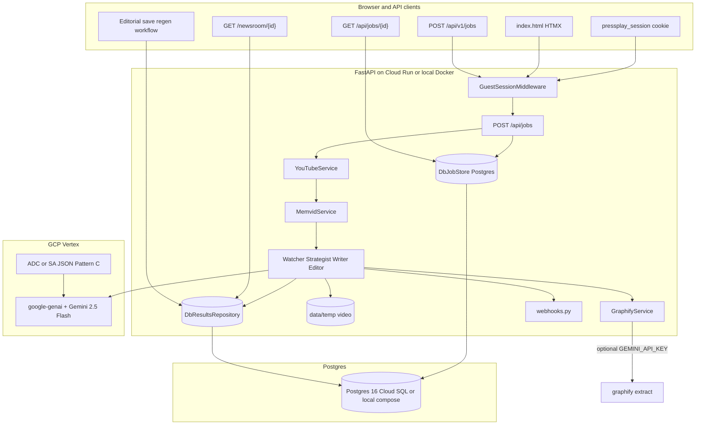

# Project Specification: The Multimodal Newsroom

## Revision history

| Date | Summary |
|------|---------|
| **2026-05-25 (h)** | **OSS transcript-only ingest:** `youtube-transcript-api` + yt-dlp captions (`fetch_transcript_unified_context`); on `DownloadError`, pipeline skips Memvid when `INGEST_TRANSCRIPT_FALLBACK=1` or `YOUTUBE_DOWNLOAD_PROVIDER=auto`. Optional **Piped** (`PIPED_API_BASE`, AGPL) in download chain. Ops matrix: `docs/YOUTUBE_INGEST_PHASE2.md`. |
| **2026-05-25 (g)** | **OSS YouTube ingest (cookies):** `YOUTUBE_COOKIES_PATH` + optional `YOUTUBE_PO_TOKEN` in [`app/config.py`](app/config.py); `YouTubeService._base_ydl_opts()` sets `cookiefile`, `player_client` `mweb`/`android`/`web`, optional PO tokens; `yt-dlp>=2025.1.0`. Cloud Run: Secret Manager `pressplay-youtube-cookies` mounted at `/secrets/youtube-cookies.txt` (`deploy.yml`). **Not** in-app Google login — operator-exported Netscape cookies only. RapidAPI/Apify remain optional `auto` fallbacks. Ops: `docs/DEPLOY_GCP.md` § YouTube cookies. |
| **2026-05-25 (f)** | **RapidAPI ingest (production):** Authorized [YouTube Video Downloader Fast](https://rapidapi.com/skdeveloper/api/youtube-video-downloader-fast) key rotated in Secret Manager (`pressplay-rapidapi-key` v2) and mounted on Cloud Run (`pressplay-00010-9wx`+). Client: `POST https://youtube-video-downloader-fast.p.rapidapi.com/download.php` with `x-rapidapi-key`, `x-rapidapi-host`, `Content-Type: application/x-www-form-urlencoded`, body `url=<watch URL>`. `providers.py` maps quota (`message`), gateway **403/429**, and `error`/`medias` payloads to clear `DownloadError` text; prefers `medias[]` MP4 links. **Ops:** `docs/DEPLOY_GCP.md` § RapidAPI request contract + secret rotation. **Blocker:** RapidAPI BASIC monthly quota can still fail jobs until plan upgraded. |
| **2026-05-25 (e)** | **Index form fix:** HTMX upgraded **1.9.10 → 2.0.4** (`base.html`) so `htmx.config.responseHandling` exists; index script guards with `Array.isArray(defaults)` and sets `error: false` on **400** / **429** swaps. **Rate limits:** `record_job_creation_limits()` runs only after successful `create_pressplay_job` — failed concurrent-cap / validation no longer consume quota (`abuse_guard.py` split `check` / `record`). **Tailwind CDN:** console warning remains (v1 scaffold); compiled CSS deferred. |
| **2026-05-25 (d)** | **YouTube ingest fallback:** `app/services/youtube_download/providers.py` — `YOUTUBE_DOWNLOAD_PROVIDER` (`ytdlp` \| `rapidapi` \| `apify` \| `auto`); RapidAPI [YouTube Video Downloader Fast](https://rapidapi.com/skdeveloper/api/youtube-video-downloader-fast) MP4 link fetch + stream; optional Apify `tazy/youtube-converter`; provider chain in `YouTubeService` with bot-block detection before fallback. **`deploy.yml`:** `YOUTUBE_DOWNLOAD_PROVIDER=auto`; `RAPIDAPI_KEY` via Secret Manager (`pressplay-rapidapi-key`) — operator setup in `docs/DEPLOY_GCP.md`. **UI:** HTMX `responseHandling` swaps **400** / **429** (rate limit, concurrent cap) into `#job-area`; loading state + `aria-hidden` on `#loading-state`. **Tests:** `tests/test_youtube_download_providers.py`. |
| **2026-05-25 (c)** | **Reliability + Cloud Run ops:** `scripts/migrate_with_retry.sh` on container start (Alembic retries until Cloud SQL ready); `wait_for_db_connection()` in app lifespan. **YouTube on datacenter IPs:** Deno in `Dockerfile` for yt-dlp JS; `player_client` `android`/`web`; bot/sign-in errors mapped to clear job failures; **no cookies/sign-in in v1**. **API:** `app/api/job_ids.py` — malformed job UUID → **404**; **`HEAD /`** for probes; webhooks on **ingest failures** (`DownloadError`, `MemvidError`). **Image:** `COPY config/` brand packs. **UI:** HTMX clears stuck loading state after job partial swap. Production abuse limits **5 / 12 / 90s** in `deploy.yml`. |
| **2026-05-25 (b)** | **Open production:** Cloud Run deploy no longer mounts `PRESSPLAY_DEMO_SECRET` (public HTTPS, no shared password). **Abuse controls** in `app/services/abuse_guard.py` — per `(guest_session_id, client_ip)` hourly cap, per-IP hourly cap, minimum seconds between jobs, global concurrent cap, HTMX honeypot (`website` field). Production limits in `deploy.yml` (`RATE_LIMIT_PER_HOUR=5`, `RATE_LIMIT_PER_IP_PER_HOUR=12`, `RATE_LIMIT_MIN_INTERVAL_SECONDS=90`). **`technical`** vertical + `config/brand-technical.yaml` (UI label **Technical Event**). |
| **2026-05-25 (a)** | **GCP production deploy:** **Cloud Run** (`pressplay`, HTTPS `*.run.app`, scale-to-zero) + **Cloud SQL** (`pressplay-db`); **Secret Manager** (`pressplay-session-secret`, `pressplay-database-url`, `pressplay-db-password`); **GitHub CI/CD** (`.github/workflows/deploy.yml` after `ci.yml`, WIF → Artifact Registry → Cloud Run); bootstrap `scripts/gcp-cloudrun-bootstrap.sh`; ops doc `docs/DEPLOY_GCP.md`; `.gitignore` hardening (`secrets/gcp-sa.json`, `cloud-sql-proxy*`, `data/temp/`). Legacy GCE VM (`pressplay-vm`, `docker-compose.prod.yml`) superseded — firewall `allow-pressplay-8000` removed. Local: `.env` uses literal `SESSION_SECRET` (not shell substitution). |
| **2026-05-24 (b)** | **Production MVP persistence:** Postgres 16 in `docker-compose` (Alembic `001_initial_schema`); `DbJobStore` / `DbResultsRepository` via `app/repositories/factory.py`; **guest sessions** (signed `pressplay_session` cookie, `SESSION_SECRET`, `GUEST_SESSION_TTL_DAYS`); per-guest ownership on jobs/press kits/homepage; DB rate limits; `/health/ready`; stale-job sweep on startup; `run.sh` DB bootstrap; pytest + CI; `scripts/smoke_mvp.sh`, `scripts/migrate_fs_to_db.py`. |
| **2026-05-24 (a)** | Phase 0 stability (Watcher claims, audit artifacts, Graphify CLI fix, `ResultsRepository.save`); vertical brand packs (`sports` \| `events` \| `corp`; **`technical`** added 2026-05-25); Phase 1 writing team (`StrategistAgent`, `EditorLinter`, pipeline stages `strategizing` / `editing`); product-direction roadmap from grill-me (implemented vs planned). |
| *(prior)* | Hackathon MVP: Watcher → Writer → Graphify, citations, editorial workflow, v1 API. |

---

## 1. Project Overview & Vision

**Concept:** "The Multimodal Newsroom" is an automated, AI-driven content generation pipeline designed for rapid media deployment. It takes a video of an event (e.g., a SpaceX launch, a sports highlight, a keynote speech)—provided as a **YouTube URL**—and autonomously transforms it into a comprehensive multimedia press kit.

**Marketing tagline:** **~60 seconds** to a full press kit (applies to **Quick mode** after the selected video window is ingested; see §3.3). **Full mode** may take **up to an hour or less** depending on video length (max **1 hour** of source video).

**Final output:**
- A polished Markdown blog post (rendered to HTML)
- An engaging **3-part Twitter thread**
- An interactive **knowledge graph** (entities and relationships), rendered with **D3.js** in the browser

**Deployment:** Public **HTTPS** URL on **GCP Cloud Run** (`https://pressplay-….run.app`, scale-to-zero compute) + **Cloud SQL** Postgres. Local dev: **Docker Compose** (`docker-compose.yml`). Demo narrative may describe a **CrewAI-style multi-agent newsroom** (Watcher → Strategist → Writer → Editor → Mapper); implementation uses a **thin Python orchestrator** (not the CrewAI library) unless loops justify a framework later (§18).

**Product positioning (v1.1):** Sell PressPlay as a **press kit factory with governance** — not a generic “YouTube summarizer.” Differentiators vs ad-hoc ChatGPT/Gemini chat: fixed deliverables (blog + 3 tweets + graph), separated fact layer (Watcher) and copy layer (Writer), **timestamped citations**, shareable `/newsroom/{id}` with **editorial workflow** (`draft` → `published`), JSON API + webhooks + exports, and Vertex on the customer’s GCP project. See `docs/PILOT_SPORTS.md` for a reference vertical pilot.

---

## 2. Locked Design Decisions

| Area | Decision |
|------|----------|
| **Source of truth** | **This spec** over any standalone HTML mock behavior. Static HTML/Stitch mocks are **visual design references only** — ported into Jinja/Tailwind, not alternate API or pipeline behavior. |
| Job execution | **Async background jobs** + HTMX polling (`POST /api/jobs`, `GET /api/jobs/{id}` every ~2s). **`DATABASE_URL` set** → `DbJobStore` (Postgres, survives restart). **Unset** → in-memory `JobStore` (dev only) |
| Video input | **YouTube URL only** (v1) — no MP4 upload UI |
| Results | Shareable **`/newsroom/{id}`**; homepage lists **this guest’s** recent press kits (`list_recent(guest_session_id)`). **`DATABASE_URL` set** → Postgres `press_kits`; **unset** → global `data/results/` (dev only) |
| Processing modes | **Quick** (default) vs **Full** — see §4 |
| LLM (Watcher/Writer) | **Gemini 2.5 Flash** via **`google-genai`** SDK with **`vertexai=True`** (Vertex backend). **Not** the legacy `google-cloud-aiplatform`–only call path. |
| LLM output | **Pydantic structured output** for Watcher (`WatcherOutput`: summary + claims) and Writer (`WriterOutput`: blog + tweets + optional `claim_refs`) |
| Citations | **Claim** objects with `start_sec` / `end_sec`, `source` (`transcript` \| `visual`); persisted as `claims.json` (FS) or `press_kits.claims` JSONB (Postgres); newsroom “jump to moment” links |
| Editorial | **WorkflowStatus** on manifest; save blog/tweets; partial regen (`tweets` \| `blog` \| `graph`) without re-ingest |
| JSON API | **`/api/v1/jobs`** + export + optional **`webhook_url`** (best-effort POST on done/failed) |
| Brand voice | **Vertical brand packs** — `config/brand-{sports\|events\|corp\|technical}.yaml`; job field **`vertical`** (default `events`); Writer `brand_prompt_suffix(vertical)`. Legacy fallback: `brand.yaml` / `config/brand.yaml` when pack missing |
| Persistence | **`DATABASE_URL` set** (production path) → Postgres `guest_sessions`, `jobs`, `press_kits`, `rate_limit_events` via SQLAlchemy 2 async + Alembic. **Unset** → in-memory jobs + `data/results/` filesystem (local UI-only; see README) |
| GCP auth | **Pattern C** — ADC locally (`gcloud auth application-default login`, **no** `GOOGLE_APPLICATION_CREDENTIALS`); **local Docker Compose:** `secrets/gcp-sa.json` → `/secrets/gcp.json`; **Cloud Run:** attached **`pressplay-runtime`** SA (metadata ADC, no JSON mount) |
| Production deploy | **Cloud Run** + **Cloud SQL** + **Secret Manager**; CI via `.github/workflows/deploy.yml` (WIF `github-actions-deployer`); see `docs/DEPLOY_GCP.md` |
| Public access (prod) | **Open** — no shared password on Cloud Run. Optional **`PRESSPLAY_DEMO_SECRET`** for private demos only (local or manual secret mount); not used by CI deploy |
| Abuse controls (prod) | **`app/services/abuse_guard.py`** — per guest+IP hourly cap, per-IP hourly cap (limits cookie cycling), submission cooldown, honeypot on HTMX form; **`MAX_CONCURRENT_JOBS=2`** global. See §10–§11 |
| Video context | **Real yt-dlp + ffmpeg** download/trim; **operator cookies** via `YOUTUBE_COOKIES_PATH` on Cloud Run (OSS production path); optional **RapidAPI/Apify** fallback on cloud IPs; **Memvid CLI/SDK** (`memvid put`, Whisper + visual search) → `unified_context`. **Cloud Run:** Deno in image; `YOUTUBE_DOWNLOAD_PROVIDER=auto` + `pressplay-youtube-cookies` recommended — see §11 |
| Agent orchestration | **Thin `PipelineRunner`** — `WatcherAgent` → `StrategistAgent` → `WriterAgent` → `EditorLinter` (rule-based, non-blocking) → `GraphifyService`; pitch as CrewAI-style, no CrewAI library |
| Mapper | **`GraphifyService`** — subprocess `graphify extract` when LLM keys available; **heuristic** graph fallback otherwise |
| Graph UI | **D3.js** (`app/static/js/graph.js`) — `graph.json` embedded in `newsroom.html` |
| Mock modes | See §10.1 — `MOCK_LLM` / missing GCP vs `PRESSPLAY_USE_MOCK=1` |
| Auth (v1) | **Guest sessions** (no signup): signed HTTP-only cookie `pressplay_session`; optional **`X-PressPlay-Session`** header for API clients; `session_token` on `POST /api/v1/jobs` response. Optional site gate: **`PRESSPLAY_DEMO_SECRET`** only when explicitly set (not production default) |
| Rate limits | **Layered** — per `(guest_session_id, client_ip)` hourly cap + per-IP hourly cap + min seconds between jobs from same IP (`enforce_job_creation_limits` in `abuse_guard.py`). Postgres when `DATABASE_URL` set; in-memory equivalent otherwise. **Max 2 concurrent** jobs globally (**locked** for v1; see §17) |
| Full mode cap | **1 hour** max source video length |

---

## 3. Technology Stack

| Layer | Choice | Notes |
|-------|--------|-------|
| Backend | **FastAPI** (Python) | Async-capable; single process + background tasks |
| Frontend | **HTML5, Jinja2, Tailwind CDN, HTMX** | No frontend build step for hackathon |
| Video download | **yt-dlp** | YouTube-only URL validation; trim for Quick mode |
| Vision / context | **Memvid Python SDK** (local) | Whisper transcript + frame/visual context → unified text payload |
| LLM | **`google-genai`** → **Vertex** (`genai.Client(vertexai=True, ...)`) | `app/adapters/gemini.py`; model default `gemini-2.5-flash` |
| Orchestration | **Thin Python pipeline** | `app/services/pipeline.py`: Watcher → Strategist → Writer → Editor (lint) → Graphify; webhooks on completion |
| Persistence (MVP deploy) | **Postgres 16** + **Alembic** | Optional `DATABASE_URL`; guest session cookies; `DbJobStore` / `DbResultsRepository` |
| Config / export | **PyYAML**, **httpx** | Brand config; webhook delivery; export helpers |
| Knowledge graph | **`graphifyy` pip package**, CLI binary **`graphify`** (also checks `graphifyy`) | `graphify extract <dir> --backend gemini --no-cluster --out <dir>`; reads `graphify-out/graph.json` |
| Graph visualization | **D3.js** | Force-directed graph from normalized JSON |
| Hosting (production) | **Cloud Run** + **Cloud SQL** (Postgres 16) | HTTPS by default; `min-instances=0`; migrations in CI deploy step |
| Hosting (local) | **Docker Compose** | Postgres 16 + API on `:8000`; `data/` for temp video and optional FS audit files |
| Session / DB | **SQLAlchemy 2 async**, **asyncpg**, **Alembic**, **itsdangerous** | `app/db/`, `app/middleware/guest_session.py`, `app/repositories/` |

**Explicitly not in v1:** CrewAI library, MP4 file upload, Pyvis server-rendered graphs, custom domain / managed cert (demo uses `*.run.app` only).

---

## 4. Processing Modes

### 4.1 Quick (default)

- Processes a **5–20 minute** window of the YouTube video (default **10 minutes**; configurable via form or env).
- Server **enforces** the window (do not rely on the client).
- Target: press kit in **~60 seconds** after Memvid ingest completes for typical clips (marketing tagline).
- Best for live demos and judges.

### 4.2 Full

- Processes up to **1 hour** of source video.
- Staged progress UI; copy: **“may take up to an hour or less.”**
- No 60-second SLA claim.

### 4.3 Mode selection (UI)

- Form fields: **YouTube URL**, **mode** (`quick` \| `full`), **`vertical`** (`events` \| `technical` \| `sports` \| `corp`), optional **quick_minutes** (5–20). Optional **demo secret** only if `PRESSPLAY_DEMO_SECRET` is set (not production).
- HTMX submits to `POST /api/jobs`; polls until `done`, then links to **`/newsroom/{id}`**.

---

## 5. System Architecture & Data Flow



### 5.1 Pipeline steps

1. **Ingestion:** User submits YouTube URL + mode on index. HTMX `POST /api/jobs` creates job; progress partial polls until `done`.
2. **Download:** `YouTubeService` validates YouTube URL, downloads via **yt-dlp** (`_base_ydl_opts`: retries, `cookiefile` when `YOUTUBE_COOKIES_PATH` set, `player_client` `mweb`/`android`/`web`, optional `YOUTUBE_PO_TOKEN`) or **external fallback** when configured (`YOUTUBE_DOWNLOAD_PROVIDER=auto` + optional `PIPED_API_BASE`, `RAPIDAPI_KEY`, `APIFY_API_TOKEN`), then trims with **ffmpeg** (Quick window or Full up to 1h). Skipped when `PRESSPLAY_USE_MOCK=1`. **Cloud/datacenter IPs:** mount operator Netscape cookies on Cloud Run (`pressplay-youtube-cookies`); no in-app Google login. **Transcript-only fallback:** if download fails and `INGEST_TRANSCRIPT_FALLBACK=1` or `auto`, build `unified_context` from `youtube-transcript-api` / captions and skip Memvid (see `docs/YOUTUBE_INGEST_PHASE2.md`).
3. **Context extraction:** `MemvidService` runs **`memvid put`** on local file → **unified_context** (Whisper transcript + visual search snippets) when a local video exists. Temp video deleted after ingest. Transcript-only path skips Memvid. Full mock uses `extract_context_stub`.
4. **Watcher:** `WatcherAgent` → `generate_structured(..., WatcherOutput)` — summary + timestamped **claims**; claim normalization (`_normalize_claims`); **retry** once if claims empty but summary non-empty; warning logs.
5. **Strategist:** `StrategistAgent` → `StrategistOutput` — editorial brief (angle, audience, thread hook, omit topics) from summary + claims; optional vertical hint in prompt (API accepts `vertical`; pipeline may omit — see §7.2).
6. **Writer:** `WriterAgent` → `WriterOutput` — blog + 3 tweets; claims + **strategist brief** in prompt; **`brand_prompt_suffix(vertical)`** from vertical pack; optional `claim_refs`.
7. **Editor:** `EditorLinter.lint` — rule-based checks (banned phrases, tweet length/count, reading level); **non-blocking** (`EditorReport` persisted; pipeline continues).
8. **Mapper:** `GraphifyService.build_graph_with_source` — `graphify` \| `heuristic`; `_build_graph_sync` runs CLI in thread (fixed method nesting — CLI path works).
9. **Persistence:** `get_results_repo().save(..., guest_session_id=...)` → Postgres `press_kits` row when `DATABASE_URL` set (blog, tweets, graph, claims, audit columns, `vertical`, mock flags); optional mirror under `data/results/{id}/` when using filesystem fallback. `workflow_status=draft`; `result_url` `/newsroom/{id}`.
10. **Webhook:** If `webhook_url` set on job, `app/services/webhooks.py` POSTs JSON payload on **done** or **failed** (async, best-effort), including **ingest-stage failures** (`DownloadError`, `MemvidError`).

**Startup (Postgres):** Container runs **`scripts/migrate_with_retry.sh`** before `uvicorn` (Alembic retries until Cloud SQL socket is up). `lifespan` runs `init_db()`, **`wait_for_db_connection()`** (up to 30×2s), **stale job sweep** (in-flight jobs → `failed` with “Interrupted by server restart”), then serves traffic.

### 5.2 Job state machine

```text
queued → downloading → memvid → watching → strategizing → writing → editing → mapping → done
                                                                                        ↘ failed
```

Progress percentages: `STAGE_PROGRESS` in `app/domain/models.py` (e.g. strategizing 55%, editing 75%).

Expose via `GET /api/jobs/{id}` for HTMX polling (e.g. every 2s):

```json
{
  "id": "uuid",
  "status": "writing",
  "stage": "writing",
  "progress_pct": 65,
  "mode": "quick",
  "vertical": "events",
  "youtube_url": "https://...",
  "error": null,
  "result_url": "/newsroom/uuid"
}
```

### 5.3 Implementation status (hackathon build)

| Component | Status | Notes |
|-----------|--------|--------|
| FastAPI + Jinja + HTMX + Tailwind CDN | **Shipped** | `app/main.py`, templates under `app/templates/` |
| `POST /api/jobs` + poll + `/newsroom/{id}` | **Shipped** | Matches locked API surface |
| `POST /api/v1/jobs` + `GET /api/v1/jobs/{id}` | **Shipped** | JSON API; optional `webhook_url` |
| `GET /api/v1/newsroom/{id}/export` | **Shipped** | `format=markdown\|json\|slack` |
| Editorial: save, workflow, partial regen | **Shipped** | `/newsroom/{id}/save`, `/api/jobs/{id}/regenerate` |
| Watcher claims + `claims.json` | **Shipped** | Citations on newsroom with jump links |
| `GET /health` | **Shipped** | Liveness for Docker / Cloud Run |
| YouTubeService (yt-dlp, Quick trim) | **Shipped** | Real unless `PRESSPLAY_USE_MOCK=1`; `player_client` `android`/`web`; optional RapidAPI/Apify fallback (`auto` + keys); bot/sign-in error mapping |
| YouTube external download (`youtube_download/`) | **Shipped** | Operator `YOUTUBE_COOKIES_PATH` for yt-dlp; RapidAPI POST → MP4 URL → httpx stream; Apify actor optional |
| Job ID validation (`job_ids.py`) | **Shipped** | Malformed UUID on poll/export → **404** (not 500) |
| `HEAD /` | **Shipped** | `200` empty body for uptime probes |
| Cold start (DB + migrations) | **Shipped** | `migrate_with_retry.sh`; `wait_for_db_connection` in lifespan |
| MemvidService (CLI ingest) | **Shipped** | Requires local `memvid` + Whisper models; see blockers §17 |
| WatcherAgent / WriterAgent | **Shipped** | Structured `WatcherOutput` + `WriterOutput`; Vertex when GCP set; mock JSON with sample claims when `should_mock_llm()` |
| Watcher claim hygiene | **Shipped** | `_normalize_claims`, empty-claims retry, completion logging |
| StrategistAgent | **Shipped** | `StrategistOutput`; `strategist_brief.json` / DB column |
| EditorLinter | **Shipped** | Rule-based; `editor_report.json` / DB column; does not fail jobs |
| Vertical brand packs | **Shipped** | `config/brand-{sports,events,corp,technical}.yaml`; `BrandVertical` enum; HTMX + v1 `vertical` (UI: General event, Technical Event, Sports post-game, Internal corporate comms) |
| Abuse guard (open prod) | **Shipped** | `app/services/abuse_guard.py`; honeypot on `POST /api/jobs`; production limits in `deploy.yml` |
| Audit artifacts | **Shipped** | `claims.json`, `unified_context.txt` under `data/results/{id}/` (and DB when configured) |
| GraphifyService | **Shipped** | CLI when keys + binary present; `_build_graph_sync` correctly scoped on class; heuristic/stub fallback |
| Postgres + guest sessions | **Shipped** | `DATABASE_URL`, Alembic `001_initial_schema`, `guest_sessions` / `jobs` / `press_kits` / `rate_limit_events`; `GuestSessionMiddleware`; ownership 404 across guests |
| `GET /health/ready` | **Shipped** | Postgres `SELECT 1`; compose healthcheck on `newsroom` |
| DB rate limiter | **Shipped** | `app/services/abuse_guard.py` (`DbAbuseGuard`); `rate_limit_db.py` wrapper; `check_rate_limit()` in `app/api/deps.py` |
| Stale job sweep | **Shipped** | `app/db/startup.py` on app lifespan |
| pytest + CI | **Shipped** | `tests/` (guest cookie, ownership, health, `test_abuse_guard.py`); `.github/workflows/ci.yml` |
| `scripts/smoke_mvp.sh` | **Shipped** | End-to-end health → guest → mock job → newsroom |
| Partial regen + Strategist/Editor | **Gap** | `regen.py` re-runs Writer/Graphify only — no Strategist or Editor on regen |
| Editor + vertical packs | **Gap** | `EditorLinter` uses default `brand_banned_phrases()` — not job `vertical` yet |
| Filesystem `manifest.vertical` | **Gap** | `ResultsRepository.save` accepts `vertical` but does not write it to `manifest.json` (DB path persists) |
| D3 newsroom graph | **Shipped** | `app/static/js/graph.js` |
| JobStore + rate limit + concurrent cap (2) | **Shipped** | `DbJobStore` or legacy `JobStore`; `check_concurrent_cap()` async |
| ResultsRepository + past runs on `/` | **Shipped** | Guest-scoped `list_recent`; Postgres or FS; manifest fields include mock flags, `workflow_status`, `vertical`, audit JSON |
| GCP production deploy | **Shipped** | Cloud Run + Cloud SQL + Secret Manager; `deploy.yml`; `docs/DEPLOY_GCP.md`; **open access** + abuse limits |
| GitHub deploy workflow | **Shipped** | `.github/workflows/deploy.yml` — build `linux/amd64` → AR → Cloud Run; prints HTTPS URL |
| `scripts/gcp-cloudrun-bootstrap.sh` | **Shipped** | Cloud SQL, secrets, firewall cleanup, Cloud Run deploy |
| Legacy VM path | **Deprecated** | `pressplay-vm`, `docker-compose.prod.yml`, `scripts/gcp-bootstrap.sh` — not used by CI |
| `run.sh` local launcher | **Shipped** | Requires `GCP_PROJECT_ID` for live Vertex path; see §12.1 |

---

## 6. Backend Design Patterns

| Pattern | Where | Purpose |
|---------|--------|---------|
| **Layered / hexagonal** | `api/` → `services/` → `adapters/` | Isolate Memvid, Graphify, Gemini from routes |
| **Job + state machine** | `get_job_store()` (`DbJobStore` \| legacy) + `JobStatus` enum | HTMX polling and staged UI; `guest_session_id` on create |
| **Pipeline** | `PipelineRunner` | Ordered steps; `await results_repo.save(..., guest_session_id)` |
| **Guest session** | `GuestSessionMiddleware` + `app/auth/guest.py` | Signed cookie; `request.state.guest` |
| **Repository factory** | `app/repositories/factory.py` | `DATABASE_URL` → DB repos; else FS + in-memory adapters |
| **Adapter** | `GeminiAdapter` (`app/adapters/gemini.py`); Memvid/Graphify as services | Swappable external tools |
| **Mock policy** | `app/services/mock_mode.py` | Central `should_mock_llm()`, `pipeline_skips_ingest()`, Graphify heuristic |
| **DTO / Pydantic** | `PressKitResult`, `WriterOutput`, etc. | Strict JSON contracts |
| **Repository** | `DbResultsRepository` \| `AsyncFsResultsRepository` | Press kits + manifest fields; guest-scoped reads |
| **Strategy** | `ProcessingMode.QUICK` \| `FULL` | Different download trim and timeouts |
| **Shared job creation** | `app/api/job_creation.py` | HTMX + v1 JSON share validation, rate limit, `schedule_pipeline` |
| **Partial regen** | `app/services/regen.py` | Re-run Writer or Graphify from disk; **skips Strategist/Editor** (known gap) |
| **Export** | `app/services/export.py` | Markdown, JSON, Slack Block Kit text for integrations |

**The Mapper** is implemented as **`GraphifyService`** (subprocess or Python API), not a third LLM-based CrewAI agent. It remains **“Agent 3 (The Mapper)”** in product language.

---

## 7. Agent Specifications

Pipeline order: **Watcher → Strategist → Writer → Editor (lint) → Mapper (Graphify service)**.

### 7.1 The Watcher (implementation: `app/services/agents/watcher.py`)

- **Role:** Video Context Analyst
- **Input:** Memvid `unified_context` string (transcript lines include `[seconds]` or `[mm:ss]` when Memvid provides timestamps — see `MemvidService._format_timeline`)
- **Goal:** Chronological factual summary **plus** atomic, timestamped claims
- **Persona (prompt):** Meticulous investigative journalist — observable facts only; no speculation
- **Implementation:** `GeminiAdapter.generate_structured(..., WatcherOutput)` (Vertex or mock stub)
- **Output contract (Pydantic):**

```json
{
  "summary": "Chronological paragraphs...",
  "claims": [
    {
      "text": "Falcon 9 lifts off from the pad.",
      "start_sec": 42.0,
      "end_sec": 55.0,
      "source": "visual",
      "youtube_url": "https://www.youtube.com/watch?v=..."
    }
  ]
}
```

`youtube_url` on each claim is set server-side from the job URL when missing from the model.

**Stability (Phase 0):** After structured generation, claims pass through `_normalize_claims` (drop empty rows; coerce `source` for Vertex JSON quirks). If the summary is non-empty but claims are empty, the agent **retries once** with `WATCHER_RETRY_SUFFIX`. Pipeline logs claim count or warns when zero claims are persisted.

### 7.2 The Strategist (implementation: `app/services/agents/strategist.py`)

- **Role:** Editorial strategist between facts and copy
- **Input:** Watcher `summary` + optional claims list (up to 30 lines in prompt)
- **Goal:** Single narrative frame for the Writer — not new facts
- **Implementation:** `GeminiAdapter.generate_structured(..., StrategistOutput)` (Vertex or mock)
- **Output contract (Pydantic):**

```json
{
  "angle": "One-sentence narrative lens",
  "target_audience": "Who this press kit is for",
  "thread_hook": "Opening theme for the 3-part thread",
  "omit_topics": ["speculation", "off-topic tangents"]
}
```

Persisted as **`strategist_brief.json`** (filesystem) or `strategist_brief` JSON column (Postgres).

### 7.3 The Writer (implementation: `app/services/agents/writer.py`)

- **Role:** Lead Copywriter & Social Media Manager
- **Input:** Watcher `summary` + numbered **claims** + optional **Strategist** brief (`angle`, `target_audience`, `thread_hook`, `omit_topics`)
- **Goal:** Markdown blog post + cohesive 3-part Twitter thread; facts must align with summary/claims
- **Persona (prompt):** Expert digital marketer; plus **vertical brand pack** via `brand_prompt_suffix(vertical)` (`app/services/brand.py` → `config/brand-{vertical}.yaml`)
- **Implementation:** `GeminiAdapter.generate_structured` with Pydantic `WriterOutput`
- **Output contract (Pydantic):**

```json
{
  "blog_post": "# Title\n\n...",
  "tweets": ["tweet 1", "tweet 2", "tweet 3"],
  "claim_refs": [0, 2]
}
```

`claim_refs` is optional — 0-based indices into the Watcher claims list for key blog statements.

**Vertical packs:** `BrandVertical` = `sports` \| `events` \| `corp` \| `technical` (default **`events`**). UI label for `technical`: **Technical Event**. Each pack supplies `tone`, `voice`, `banned_phrases`, `hashtag_policy`, `max_tweet_chars`.

### 7.4 The Editor (implementation: `app/services/agents/editor.py`)

- **Role:** Post-Writer **linter** (deterministic rules, not an LLM)
- **Input:** `WriterOutput` (blog + tweets)
- **Checks:** Banned phrases (from brand config), per-tweet length vs `max_tweet_chars`, tweet count = 3, blog reading level (avg/max words per sentence)
- **Behavior:** **Non-blocking** — violations recorded; pipeline always proceeds to mapping
- **Output contract (Pydantic):**

```json
{
  "passed": false,
  "violations": [
    { "rule": "banned_phrase", "message": "...", "location": "blog" }
  ]
}
```

Persisted as **`editor_report.json`** (filesystem) or `editor_report` JSON column (Postgres). Newsroom UI may surface this in a later pass.

### 7.5 The Mapper (implementation: `app/services/graphify.py`)

- **Role:** Knowledge Graph Architect (service, not LLM agent)
- **Input:** Final `blog_post` markdown (written to temp dir as `blog.md`)
- **Tool:** Graphify CLI — package **`graphifyy`**, executable **`graphify`** (fallback name `graphifyy`; override via `GRAPHIFY_BIN`)
- **Command:** `graphify extract <work_dir> --no-cluster --out <work_dir> [--backend gemini]` when `graphify_llm_available()`; output at `graphify-out/graph.json`
- **Auth gap:** PressPlay Watcher/Writer use **Vertex via `google-genai` + ADC/SA**. Graphify CLI semantic extract typically needs **`GEMINI_API_KEY`** (or other vendor keys in env). Vertex SA alone may not satisfy the CLI — heuristic graph used when keys missing or `should_mock_llm()`
- **Fallback:** Regex/heuristic graph from markdown headings, bold, caps; fixed SpaceX stub if too sparse
- **Output contract (normalized for D3):**

```json
{
  "nodes": [
    { "id": "spacex", "label": "SpaceX", "group": "org" }
  ],
  "edges": [
    { "source": "spacex", "target": "falcon9", "label": "launched" }
  ]
}
```

Graphify’s native `graph.json` is adapted to this shape in a small Python mapper.

---

## 8. API Surface

| Method | Path | Purpose |
|--------|------|---------|
| `GET` / `HEAD` | `/` | Form + **guest-scoped** recent press kits (`HEAD` → `200` for probes) |
| `POST` | `/api/jobs` | Create job (HTMX); returns progress partial |
| `GET` | `/api/jobs/{id}` | Poll status / stage (HTMX `every 2s`) |
| `GET` | `/newsroom/{id}` | Shareable results: blog, tweets, D3 graph, citations, editorial UI |
| `GET` | `/health` | Liveness `{"status":"ok"}` |
| `GET` | `/health/ready` | Readiness — Postgres `SELECT 1` when `DATABASE_URL` set; 503 if DB down |
| `POST` | `/api/v1/jobs` | JSON create job; optional `webhook_url` |
| `GET` | `/api/v1/jobs/{id}` | JSON poll status |
| `GET` | `/api/v1/newsroom/{id}/export` | `format=json\|markdown\|slack` |
| `POST` | `/newsroom/{id}/save` | Save edited blog/tweets |
| `POST` | `/newsroom/{id}/workflow` | `draft` → `in_review` → `approved` → `published` |
| `POST` | `/api/jobs/{id}/regenerate` | Partial regen: `tweets`, `blog`, or `graph` |

**HTMX `POST /api/jobs` form fields:** `youtube_url`, `mode` (`quick` \| `full`), **`vertical`** (`sports` \| `events` \| `corp` \| `technical`, default `events`), optional `quick_minutes` (5–20), hidden honeypot `website` (must be empty), optional `secret` (only when `PRESSPLAY_DEMO_SECRET` is set).

**JSON `POST /api/v1/jobs` body:**

```json
{
  "youtube_url": "https://www.youtube.com/watch?v=...",
  "mode": "quick",
  "quick_minutes": 10,
  "vertical": "events",
  "webhook_url": "https://example.com/hooks/pressplay",
  "secret": "optional-demo-secret"
}
```

Validation: `parse_brand_vertical()` in `app/api/job_creation.py` — invalid values return 400 with message `vertical must be 'sports', 'events', 'corp', or 'technical'.`

**Response:** `{ "id", "status", "poll_url", "session_token" }` — `session_token` is the signed guest cookie value for programmatic clients (also set via `Set-Cookie` on first request). Header `X-PressPlay-Secret` accepted when demo secret is enabled. Header **`X-PressPlay-Session`** carries the same signed token as the cookie for non-browser clients.

**Access control:** Poll, newsroom, export, editorial, and regen require the job/press kit to belong to the current guest (404 if not — no cross-guest leakage). **Job IDs** must be valid UUIDs (`parse_job_id` in `app/api/job_ids.py`); malformed paths return **404** before store lookup.

**`POST /api/jobs/{id}/regenerate` form field:** `part` = `tweets` \| `blog` \| `graph` (no re-ingest; uses `summary.txt`, `claims.json`, and on-disk blog). **Known gap:** does **not** re-run Strategist or Editor; Writer regen uses summary + claims + **`vertical` from manifest** when present (Postgres / persisted manifest).

**Webhook payload (on done/failed):** `{ "id", "status", "result_url", "youtube_url" }`.

---

## 9. Repository Layout

```text
pressplay/
├── run.sh                        # deps, Memvid/Whisper checks, ADC/SA, --verify-llm
├── Dockerfile                    # ffmpeg, Deno (yt-dlp), COPY config/, memvid-sdk, whisper-small
├── docker-compose.yml            # Postgres 16 + newsroom; migrate_with_retry on start
├── alembic.ini
├── pytest.ini
├── requirements.txt              # sqlalchemy, asyncpg, alembic, itsdangerous, pytest
├── .env.example
├── README.md
├── config/
│   ├── brand-sports.yaml         # vertical pack (sports post-game)
│   ├── brand-events.yaml         # default vertical pack
│   ├── brand-corp.yaml           # internal corporate comms
│   ├── brand-technical.yaml      # technical events (conferences, keynotes, launches)
│   └── brand.yaml.example        # legacy single-file override
├── alembic/                      # Postgres migrations (when DATABASE_URL set)
├── docs/
│   └── PILOT_SPORTS.md           # sports post-game pilot metrics vs ChatGPT
├── app/
│   ├── main.py
│   ├── config.py
│   ├── api/
│   │   ├── routes_pages.py
│   │   ├── routes_jobs.py        # HTMX jobs
│   │   ├── routes_v1.py          # JSON API + export
│   │   ├── routes_editorial.py   # save, workflow, regen
│   │   ├── job_creation.py       # shared create_pressplay_job(guest_session_id)
│   │   ├── job_ids.py            # parse_job_id → 404 on malformed UUID
│   │   ├── deps.py               # rate limit, concurrent cap, optional demo secret
│   │   └── deps_guest.py         # get_current_guest, get_guest_id
│   ├── middleware/
│   │   └── guest_session.py      # cookie + X-PressPlay-Session
│   ├── auth/
│   │   └── guest.py              # sign/unsign guest_id
│   ├── domain/
│   │   ├── models.py             # Claim, WatcherOutput, WorkflowStatus, …
│   │   └── errors.py
│   ├── adapters/
│   │   └── gemini.py
│   ├── services/
│   │   ├── mock_mode.py
│   │   ├── job_store.py          # optional webhook_url on JobRecord
│   │   ├── pipeline.py
│   │   ├── regen.py              # partial regen
│   │   ├── webhooks.py
│   │   ├── export.py
│   │   ├── brand.py
│   │   ├── youtube.py            # provider chain → yt-dlp or external fallback
│   │   ├── youtube_download/
│   │   │   └── providers.py      # RapidAPI, Apify, resolve_provider_chain
│   │   ├── memvid.py
│   │   ├── graphify.py
│   │   ├── results_repo.py       # filesystem persistence (legacy dev)
│   │   ├── guest_sessions.py     # guest_sessions CRUD
│   │   ├── abuse_guard.py        # layered rate limits, cooldown, honeypot helper
│   │   ├── rate_limit_db.py      # Postgres wrapper → DbAbuseGuard
│   │   └── agents/
│   │       ├── watcher.py
│   │       ├── strategist.py
│   │       ├── writer.py
│   │       └── editor.py
│   ├── repositories/
│   │   ├── factory.py            # Db* vs filesystem from DATABASE_URL
│   │   ├── db_job_store.py
│   │   ├── db_results_repo.py
│   │   └── fs_adapter.py
│   ├── db/
│   │   ├── models.py             # guest_sessions, jobs, press_kits, rate_limit_events
│   │   ├── session.py            # async engine + session factory
│   │   └── startup.py            # stale job sweep
│   ├── static/js/graph.js
│   └── templates/
│       ├── base.html
│       ├── index.html
│       ├── newsroom.html         # citations, editorial, export links
│       ├── error.html
│       └── partials/
├── data/
│   ├── jobs/
│   └── results/{id}/
│       ├── manifest.json         # workflow_status, vertical, ingest_duration_sec, graph_source, …
│       ├── blog.md
│       ├── tweets.json
│       ├── graph.json
│       ├── claims.json           # audit / citations
│       ├── unified_context.txt   # Memvid payload (audit)
│       ├── strategist_brief.json
│       ├── editor_report.json
│       └── summary.txt
├── secrets/                      # gitignored — gcp-sa.json for Docker
├── tests/                        # pytest + postgres (CI)
│   ├── conftest.py
│   ├── test_health.py
│   ├── test_guest_session.py
│   ├── test_ownership.py
│   ├── test_abuse_guard.py      # honeypot + in-memory abuse limits
│   ├── test_job_ids.py
│   ├── test_index_head.py
│   ├── test_youtube.py
│   ├── test_youtube_errors.py
│   └── test_youtube_download_providers.py
├── .github/workflows/
│   ├── ci.yml                    # pytest + Alembic on PR/push to main
│   └── deploy.yml                # Cloud Run deploy after CI on main
├── docker-compose.yml            # local dev
├── docker-compose.prod.yml       # legacy GCE VM (deprecated)
├── docs/
│   ├── DEPLOY_GCP.md             # Cloud Run + Cloud SQL + CI/CD runbook
│   └── PILOT_SPORTS.md
└── scripts/
    ├── verify_gcp.py
    ├── cleanup_ttl.py
    ├── smoke_mvp.sh              # health → guest → job → newsroom
    ├── migrate_fs_to_db.py       # optional FS → Postgres import
    ├── migrate_with_retry.sh     # Alembic retry loop (Cloud SQL cold start)
    ├── gcp-cloudrun-bootstrap.sh # production bootstrap (Cloud SQL + Cloud Run)
    ├── gcp-bootstrap.sh          # legacy VM bootstrap (deprecated)
    └── gcp-vm-startup.sh         # legacy VM Docker install
```

---

## 10. Configuration Defaults

| Setting | Default | Notes |
|---------|---------|-------|
| `GCP_PROJECT_ID` | *(empty)* | Preferred; `VERTEX_PROJECT` alias. Unset → auto **mock LLM** (ingest still real unless full mock) |
| `GCP_LOCATION` | `us-central1` | `VERTEX_LOCATION` alias |
| `GEMINI_MODEL` | `gemini-2.5-flash` | Vertex model id for Watcher/Writer |
| `GOOGLE_APPLICATION_CREDENTIALS` | *(unset locally)* | **Local Docker Compose only:** `/secrets/gcp.json` from `secrets/gcp-sa.json`; **not** used on Cloud Run |
| `MOCK_LLM` | `false` | `true` → stub Watcher/Writer; **real** yt-dlp + Memvid |
| `PRESSPLAY_USE_MOCK` | *(empty)* | `1` → **full fast mock** (skip ingest); `0` → force real ingest even without GCP |
| `MAX_CONCURRENT_JOBS` | `2` | **Locked** for v1; global active pipeline cap |
| `RATE_LIMIT_PER_HOUR` | `5` | Per `(guest_session_id, client_ip)` per rolling hour (local default) |
| `RATE_LIMIT_PER_IP_PER_HOUR` | `10` | Per client IP across all guest sessions (local default) |
| `RATE_LIMIT_MIN_INTERVAL_SECONDS` | `60` | Minimum seconds between job creations from same IP (local default) |
| `QUICK_MINUTES_DEFAULT` | `10` | Allowed range 5–20 |
| `QUICK_MINUTES_MIN` / `MAX` | `5` / `20` | Server-enforced |
| `FULL_MAX_VIDEO_SECONDS` | `3600` | 1 hour |
| `RESULTS_TTL_HOURS` | `72` | `scripts/cleanup_ttl.py` |
| `PRESSPLAY_DEMO_SECRET` | *(unset)* | Optional shared-secret gate for **private demos only**; **not** mounted on Cloud Run by `deploy.yml` |
| `SESSION_SECRET` (production) | Secret Manager | `pressplay-session-secret` — not in `.env` on Cloud Run |
| `DATABASE_URL` (production) | Secret Manager | `pressplay-database-url` — Cloud SQL unix socket (`/cloudsql/...`) |
| `GRAPHIFY_BIN` | *(auto)* | Override path to `graphify` binary |
| `YOUTUBE_DOWNLOAD_PROVIDER` | `ytdlp` | `ytdlp` \| `rapidapi` \| `apify` \| `auto` (yt-dlp then configured fallbacks) |
| `YOUTUBE_COOKIES_PATH` | *(unset)* | Netscape `cookies.txt` for yt-dlp (`/secrets/youtube-cookies.txt` on Cloud Run) |
| `YOUTUBE_PO_TOKEN` | *(unset)* | Optional comma-separated yt-dlp PO tokens |
| `RAPIDAPI_KEY` | *(unset)* | RapidAPI key for skdeveloper YouTube Video Downloader Fast (Cloud Run Secret Manager) |
| `APIFY_API_TOKEN` | *(unset)* | Optional Apify token for `tazy/youtube-converter` |
| `GEMINI_API_KEY` | *(optional)* | For Graphify CLI `--backend gemini`; not required for Vertex Watcher/Writer |
| `DATABASE_URL` | *(unset = FS dev)* | `postgresql+asyncpg://...` → Postgres jobs, press kits, guest sessions |
| `SESSION_SECRET` | *(required in compose / .env)* | Cookie signing; use literal hex from `openssl rand -hex 32` in `.env` (no shell `$(...)` in file) |
| `GUEST_SESSION_TTL_DAYS` | `30` | Guest session lifetime |

**Optional auth:** If `PRESSPLAY_DEMO_SECRET` is set, require matching form field `secret` or `X-PressPlay-Secret` header. Production deploy leaves this unset (open site).

**Production abuse defaults** (set in `.github/workflows/deploy.yml` `--set-env-vars`, overridable):

| Env var | Cloud Run value | Purpose |
|---------|-----------------|--------|
| `RATE_LIMIT_PER_HOUR` | `5` | Per guest session + IP |
| `RATE_LIMIT_PER_IP_PER_HOUR` | `12` | Per IP (mitigates new guest cookies) |
| `RATE_LIMIT_MIN_INTERVAL_SECONDS` | `90` | Cooldown between jobs from same IP |
| `MAX_CONCURRENT_JOBS` | `2` | Global concurrent pipelines |

**HTMX honeypot:** hidden form field `website`; non-empty → `400` (`ValidationError: Invalid submission.`). Bots only; API clients unaffected.

### 10.1 Mock & demo modes (implemented)

Central logic: `app/services/mock_mode.py`.

| Mode | Env | Ingest (yt-dlp + Memvid) | Watcher / Writer | Graph |
|------|-----|--------------------------|------------------|-------|
| **Default without GCP** | `GCP_PROJECT_ID` unset, `PRESSPLAY_USE_MOCK` unset | **Real** | Mock (canned via `GeminiAdapter`) | Heuristic |
| **Mock LLM** | `MOCK_LLM=true` | **Real** | Mock | Heuristic |
| **Full fast mock** | `PRESSPLAY_USE_MOCK=1` | **Skipped** (stub context) | Mock | Heuristic |
| **Force real ingest** | `PRESSPLAY_USE_MOCK=0` | **Real** even if GCP unset | Per GCP / `MOCK_LLM` | Per keys |
| **Live pipeline** | `GCP_PROJECT_ID` + ADC or SA, mocks off | **Real** | **Vertex** (`google-genai`) | Graphify CLI when keys + binary; else heuristic |

**Verify live Vertex:** `./run.sh --verify-llm` → `scripts/verify_gcp.py` (fails if `should_mock_llm()`).

---

## 10.2 Local development tooling

| Tool | Purpose |
|------|---------|
| **`./run.sh`** | Creates/uses `.venv`, installs `requirements.txt`, checks `ffmpeg`, `yt-dlp`, **memvid-sdk** / `memvid` CLI and **Whisper model** (warns if missing), `graphify`, loads `.env`, **`docker compose up -d db`** + **`alembic upgrade head`** when `DATABASE_URL` set, validates **Pattern C** ADC or SA, warns if `PRESSPLAY_USE_MOCK=1` or unset `SESSION_SECRET`, optional `--verify-llm`, starts `uvicorn --reload`. **Requires `GCP_PROJECT_ID`** for live Vertex startup. |
| **`./run.sh --skip-server`** | Checks only |
| **`scripts/verify_gcp.py`** | One-shot Vertex `generate_text` smoke test |
| **`scripts/cleanup_ttl.py`** | Delete `data/results/*` older than `RESULTS_TTL_HOURS` |
| **Manual / mock demo** | `uvicorn app.main:app --reload` without `run.sh` when GCP unset or using `PRESSPLAY_USE_MOCK=1` |

See `README.md` for command examples.

---

## 11. Guardrails & Error Handling

- **YouTube only** — reject non-YouTube URLs; handle private/unavailable/live-not-ready with clear HTMX error partials.
- **YouTube on cloud IPs** — Cloud Run/datacenter egress often triggers bot/sign-in blocks. **Production (OSS):** mount `pressplay-youtube-cookies` → `YOUTUBE_COOKIES_PATH` (operator-exported Netscape file; no in-app Google login). Optional `YOUTUBE_DOWNLOAD_PROVIDER=auto` with `RAPIDAPI_KEY` / `APIFY_API_TOKEN` as paid fallbacks. See `docs/DEPLOY_GCP.md` § YouTube cookies and RapidAPI fallback.
- **Malformed job IDs** — non-UUID `job_id` path segments → **404** via `parse_job_id()` (HTMX poll and v1 JSON/export).
- **Concurrent cap** — max 2 active pipelines globally (`DbJobStore.active_count_async` when Postgres enabled); busy submissions return **400** (“Server is busy…”); HTMX swaps 400 body into `#job-area` (§13.1).
- **Rate limits** — `enforce_job_creation_limits()` checks caps; `record_job_creation_limits()` runs only after a job row is created (so concurrent-cap / validation failures do not burn quota). Per `(guest_session_id, client_ip)` hourly cap, per-IP hourly cap, and minimum interval between jobs from the same IP. Returns **429** with user-facing messages; HTMX index swaps 429 body into `#job-area` (§13.1).
- **Honeypot** — HTMX `POST /api/jobs` rejects non-empty hidden `website` field.
- **Optional demo secret** — when `PRESSPLAY_DEMO_SECRET` is set only (not production default).
- **Guest ownership** — cross-guest access to jobs/newsrooms returns **404** (not 403).
- **Stale jobs** — in-flight jobs marked `failed` on server restart when using Postgres.
- **Quick mode** — server-side enforce 5–20 minute processing window.
- **Full mode** — max 1 hour of source video; staged progress, no 60s claim.
- **Playlists** — not supported in v1 unless explicitly added later.
- **Temp files** — delete YouTube downloads after Memvid; TTL cleanup for old `data/results/`.

---

## 12. GCP & Docker Deployment

**Runbook:** `docs/DEPLOY_GCP.md` (authoritative for operators). **Project:** `project-3bb9c91c-69ed-4507-998`, region **`us-central1`**.

### 12.1 Production (shipped) — Cloud Run + Cloud SQL

| Component | Resource | Notes |
|-----------|----------|-------|
| Public URL | `https://pressplay-….run.app` | HTTPS on 443; **no `:8000` in URL** |
| Compute | Cloud Run service **`pressplay`** | `min-instances=0`, `max-instances=3`, 2 vCPU, 4 GiB, timeout 3600s |
| Database | Cloud SQL **`pressplay-db`** | Postgres 16, `db-f1-micro` — **always on** (Cloud Run scales to zero; DB does not) |
| Image | Artifact Registry `pressplay/newsroom` | `linux/amd64` builds only |
| Runtime SA | `pressplay-runtime@…` | Vertex (`roles/aiplatform.user`), Cloud SQL client, Secret Accessor |
| Deploy SA (CI) | `github-actions-deployer@…` | WIF pool `github-pool` / provider `github-provider`; repo `sethum-VS/PressPlay` |
| Ingress security | No world-open VM `:8000` | Firewall `allow-pressplay-8000` **removed** at Cloud Run bootstrap |

**Secret Manager → Cloud Run env:**

| Secret | Env var |
|--------|---------|
| `pressplay-session-secret` | `SESSION_SECRET` |
| `pressplay-database-url` | `DATABASE_URL` (asyncpg + `/cloudsql/PROJECT:REGION:pressplay-db`) |
| `pressplay-db-password` | Used when building `pressplay-database-url` |
| `pressplay-youtube-cookies` *(recommended)* | File at `YOUTUBE_COOKIES_PATH=/secrets/youtube-cookies.txt` |
| `pressplay-rapidapi-key` *(optional)* | `RAPIDAPI_KEY` — paid YouTube download fallback |

**Cloud Run env (not secrets):** `GCP_PROJECT_ID`, `GCP_LOCATION`, `DEBUG=false`, `YOUTUBE_DOWNLOAD_PROVIDER=auto`, plus abuse limits — see §10 production table.

**CI/CD:** Push to `main` → `ci.yml` (pytest) → `deploy.yml` (build/push image, Cloud Run start command runs `scripts/migrate_with_retry.sh` then `uvicorn`, `gcloud run deploy`, print HTTPS URL and abuse-limit summary in job log).

**GitHub Actions variables:** `GCP_PROJECT_ID`, `GCP_REGION`, `GCP_AR_REPOSITORY`, `GCP_IMAGE_NAME`, `GCP_CLOUD_RUN_SERVICE`, `GCP_SQL_INSTANCE`. No GitHub secrets required when WIF is configured.

**Bootstrap (one-time):** `./scripts/gcp-cloudrun-bootstrap.sh <GCP_PROJECT_ID>`

### 12.2 GCP auth — Pattern C (locked)

| Environment | Credentials | Configuration |
|-------------|-------------|-----------------|
| **Local dev** | [Application Default Credentials](https://cloud.google.com/docs/authentication/application-default-credentials) | `gcloud auth application-default login`; set `GCP_PROJECT_ID`, `GCP_LOCATION` in `.env`; **leave `GOOGLE_APPLICATION_CREDENTIALS` unset** |
| **Local Docker Compose** | Service account JSON | `secrets/gcp-sa.json` → mount `/secrets/gcp.json`; `GOOGLE_APPLICATION_CREDENTIALS=/secrets/gcp.json` |
| **Cloud Run (production)** | Attached **`pressplay-runtime`** SA | Metadata ADC; **no** `GOOGLE_APPLICATION_CREDENTIALS` / JSON mount |

`GeminiAdapter` uses `google.genai.Client(vertexai=True, project=..., location=...)`. Startup logs `Gemini auth mode: adc | service_account | mock`.

### 12.3 Local development — `docker-compose.yml`

**Postgres 16** + API on **`http://localhost:8000`**. `migrate_with_retry.sh` on container start; guest session middleware; optional `secrets/gcp-sa.json` mount for Vertex in Docker.

```yaml
services:
  db:
    image: postgres:16-alpine
    ports: ["5432:5432"]           # local dev only
  newsroom:
    build: .
    ports: ["8000:8000"]
    volumes:
      - ./data:/app/data
      - ./secrets/gcp-sa.json:/secrets/gcp.json:ro   # optional; gitignored
    environment:
      DATABASE_URL: postgresql+asyncpg://pressplay:pressplay@db:5432/pressplay
      SESSION_SECRET: ${SESSION_SECRET}
      GOOGLE_APPLICATION_CREDENTIALS: /secrets/gcp.json
```

**`.env` (local):** `GCP_PROJECT_ID`, `GCP_LOCATION`, `DATABASE_URL` (localhost), `SESSION_SECRET` as a **literal** hex string (`openssl rand -hex 32`). Do not use `SESSION_SECRET=$(openssl …)` in the file — dotenv does not execute shell.

### 12.4 Legacy GCE VM (deprecated)

| Item | Status |
|------|--------|
| VM `pressplay-vm` (`us-central1-a`, `e2-standard-4`) | May still exist; **not** updated by `deploy.yml` |
| `docker-compose.prod.yml`, `scripts/gcp-bootstrap.sh` | Reference only |
| Cost savings | Stop or delete VM when Cloud Run demo is sufficient — see `docs/DEPLOY_GCP.md` |

### 12.5 Container image

`Dockerfile`: Python 3.11-slim; `ffmpeg`, `curl`, **Deno** (yt-dlp JS runtime on server IPs); pip deps; **`COPY config/`** (vertical brand packs required at runtime); `memvid-sdk` + best-effort `whisper-small` at build.

**Cloud Run / Compose start:** `sh scripts/migrate_with_retry.sh && exec uvicorn …` — Alembic retries until Postgres/Cloud SQL is reachable, then app lifespan runs **`wait_for_db_connection()`** before stale-job sweep.

**Memvid:** Operators should verify `memvid` CLI + `whisper-small` in the image or accept ingest limitations — see §17.

---

## 13. Frontend

**Design source:** Stitch/HTML mock tokens (colors, typography, spacing) ported into **`app/templates/base.html`** and child templates. Mock pages do **not** define API routes, job flow, or pipeline behavior — **spec §2 and §8 win**.

### 13.1 Index (`index.html`)

- Positioning copy: **press kit factory** (auditable blog, social, graph; citations; editorial workflow)
- YouTube URL input
- **Content vertical** select: `events` (default, “General event”) \| `technical` (“Technical Event”) \| `sports` \| `corp`
- Mode toggle: **Quick** / **Full**
- Quick mode: duration control (**5–20 min**, default 10)
- Submit → HTMX `hx-post="/api/jobs"` → `partials/job_progress.html` or error partial
- **HTMX error swap:** **HTMX 2.0.4** (`unpkg.com/htmx.org@2.0.4`); `htmx.config.responseHandling` prepends `{ code: '400', swap: true, error: false }` and `{ code: '429', swap: true, error: false }` (with `Array.isArray` guard) so rate-limit / validation / “server busy” responses render in `#job-area`
- **Loading state:** script clears `#loading-state` `htmx-request` on `htmx:afterRequest` / `htmx:afterSwap`; sets `aria-hidden` when idle
- Poll `GET /api/jobs/{id}` (`hx-trigger="every 2s"`) until `done` → link to `/newsroom/{id}`
- **Your recent press kits** from `list_recent(guest_session_id)` (guest-scoped)
- Optional banner: guest session expiry (`guest_expires`, `guest_session_days`)
- Hidden honeypot field `website` (off-screen; must stay empty)
- **Demo secret** field only when `PRESSPLAY_DEMO_SECRET` is set (optional private demos; **not** on production Cloud Run)

### 13.2 Newsroom (`newsroom.html`)

- **Workflow** dropdown: `draft` → `in_review` → `approved` → `published` (`POST /newsroom/{id}/workflow`)
- **Source citations** list with “Jump to moment” (`youtube_url&t=XXs`) when `start_sec` is set
- Blog: Markdown → HTML; **edit form** (`POST /newsroom/{id}/save`) for blog + 3 tweets
- **Partial regen** buttons: tweets, blog, graph (`POST /api/jobs/{id}/regenerate`)
- Three tweet cards + copy-to-clipboard
- D3 force graph: `graph.json` + `/static/js/graph.js`
- **Export links:** `/api/v1/newsroom/{id}/export?format=markdown|json|slack`

### 13.3 Chrome / navigation

- Top nav in `base.html` (**Dashboard**, Sources, Analytics) is **decorative** for hackathon polish — only **Dashboard** (`/`) is wired. Sources/Analytics are non-functional placeholders unless added post-v1.

---

## 14. Hackathon Execution Plan (checklist)

| Step | Scope | Status |
|------|--------|--------|
| 1 Foundation | FastAPI, Jinja, Tailwind CDN, HTMX, `POST/GET /api/jobs`, JobStore, index + progress partials, Docker compose, `.env.example`, `run.sh` | **Done** |
| 2 Eyes & Ears | `YouTubeService`, `MemvidService`, pipeline `downloading` → `memvid` | **Done** (Memvid runtime install still operator-dependent) |
| 3 Brains | `GeminiAdapter` (`google-genai` Vertex), `WatcherAgent`, `WriterAgent` + Pydantic, mock modes | **Done** |
| 4 Mapper | `GraphifyService` (`graphify extract` + heuristic), D3 `graph.js`, `mapping` stage | **Done** |
| 5 Paint | `ResultsRepository`, `/newsroom/{id}`, past runs, error partials, rate limit, concurrent cap=2 | **Done** |
| 6 Deploy | Cloud Run, HTTPS, public smoke test | **Done** |
| 7 Viability (B2B) | Citations, editorial workflow, v1 API/webhooks/export, brand.yaml, sports pilot doc | **Done** |
| 8 Phase 0 — Stability | Watcher claim normalization/retry; audit `unified_context.txt`; Graphify `_build_graph_sync` fix; save() vertical param | **Done** |
| 9 Phase 1 — Writing team | Strategist + Editor linter; pipeline stages; brand vertical packs | **Done** |
| 10 Postgres MVP | `DATABASE_URL`, Alembic, guest sessions, docker-compose DB | **Done** |
| 11 Deploy | Cloud Run, HTTPS, open access + abuse limits, CI/CD | **Done** |

---

## 15. Persisted Result Artifacts

Per job `data/results/{id}/`:

| File | Content |
|------|---------|
| `manifest.json` | id, youtube_url, mode, title, created_at, `workflow_status`, **`vertical`**, `pipeline_mock`, `llm_mock`, optional `ingest_duration_sec`, `gemini_model`, `graph_source` (`graphify` \| `heuristic` \| `stub`) |
| `blog.md` | Markdown blog post (editable via newsroom save) |
| `tweets.json` | Array of 3 tweets |
| `graph.json` | D3-ready nodes/edges |
| `claims.json` | Array of `Claim` objects — **audit / citations** (backward-compatible: missing → empty list) |
| `unified_context.txt` | Memvid unified context string — **audit** (written when non-empty) |
| `strategist_brief.json` | `StrategistOutput` from Strategist agent |
| `editor_report.json` | `EditorReport` from Editor linter (violations; job still completes) |
| `summary.txt` | Watcher summary (used by partial regen) |

**Postgres:** Same fields on `press_kits` row when `DATABASE_URL` is set (`unified_context`, `strategist_brief`, `editor_report`, `vertical`, `claims` JSONB, etc.). Filesystem-only dev may omit `vertical` on `manifest.json` until `ResultsRepository.save` writes it (see §5.3).

### 15.2 Postgres schema (production MVP — shipped)

When `DATABASE_URL` is set, Alembic revision **`001_initial_schema`** creates:

| Table | Purpose |
|-------|---------|
| `guest_sessions` | `id` (UUID PK), `created_at`, `expires_at`, `last_seen_at` |
| `jobs` | Pipeline state; `guest_session_id` FK; `status`, `stage`, `progress_*`, `mode`, `youtube_url`, `quick_minutes`, `vertical`, `error`, `result_url`, `webhook_url`, timestamps |
| `press_kits` | Editorial artifacts; same `id` as job when complete; `guest_session_id` FK; `blog_post`, `tweets`/`graph`/`claims` JSONB, audit columns, `workflow_status`, mock flags |
| `rate_limit_events` | Sliding-window job creation events for abuse guard (per guest + IP; IP-wide counts derived in queries) |

**Guest session flow (`app/middleware/guest_session.py`):**

1. Skip `/health`, `/static`, `/favicon.ico`.
2. Read signed cookie `pressplay_session` or header `X-PressPlay-Session` (`itsdangerous.URLSafeTimedSerializer` + `SESSION_SECRET`).
3. Valid token + non-expired row → `touch_guest_session`; else create new `guest_sessions` row and set cookie.
4. Attach `request.state.guest` (`GuestContext`: `id`, `expires_at`).
5. Cookie: HTTP-only, `SameSite=Lax`, `Secure` when `DEBUG=false`; max age `GUEST_SESSION_TTL_DAYS` (default **30**).

**Future registered users:** add `users` table and `guest_sessions.user_id` without rewriting `press_kits` schema.

---

## 15.1 Phase 0 — Stability & audit (shipped)

| Item | Implementation |
|------|----------------|
| Graphify CLI path | `GraphifyService._build_graph_sync` is a proper instance method; `asyncio.to_thread` invokes CLI extract reliably |
| Watcher claims | `_normalize_claims`; retry with `WATCHER_RETRY_SUFFIX` when claims empty |
| Audit disk artifacts | `claims.json` + `unified_context.txt` per job under `data/results/{id}/` |
| Save API | `ResultsRepository.save(..., vertical=..., unified_context=..., strategist_brief=..., editor_report=...)` — fixed prior `NameError` on `vertical` kwarg |

---

## 16. Out of Scope (v1)

- MP4 file upload UI
- CrewAI / LangGraph library integration
- User accounts / OAuth / SSO (guest sessions are **not** registered users)
- Org tenancy / per-org API keys
- Custom domain + Google-managed SSL (demo uses Cloud Run `*.run.app` only)
- Graphify HTML visualization (using D3 only)
- Playlist / multi-video batch processing
- Scale-to-zero **database** (Cloud SQL stays always on for durable jobs)
- Automated claim verification (entailment model) — citations are model-generated, not cryptographically proven
- WordPress/HubSpot push integrations (export formats only; no OAuth to CMS)

---

## 17. Open Items & Blockers

### Resolved (hackathon + viability pass)

- [x] **Vertex vs Agent Platform SDK** — **`google-genai`** with `vertexai=True` and `GeminiAdapter`
- [x] **Concurrent jobs** — **`MAX_CONCURRENT_JOBS=2`** locked for v1
- [x] **Frontend visual design** — HTML mock tokens in Jinja (`base.html`)
- [x] **Graphify packaging** — **`graphifyy`**, CLI **`graphify extract`**
- [x] **GCP auth** — **Pattern C** (ADC local, SA JSON in Docker)
- [x] **Mock strategy** — §10.1
- [x] **HTMX API** — YouTube-only, jobs poll, `/newsroom/{id}`, Quick/Full
- [x] **Watcher structured output** — `WatcherOutput` + `claims.json` + newsroom citation UI
- [x] **Writer grounding** — claims in prompt; optional `claim_refs`; `brand.yaml` injection
- [x] **Editorial workflow** — save edits, workflow states, partial regen (`regen.py`)
- [x] **JSON API v1** — `POST/GET /api/v1/jobs`, export, webhooks
- [x] **Docker / run.sh ingest** — memvid-sdk + Whisper install hints/checks
- [x] **Sports pilot doc** — `docs/PILOT_SPORTS.md`, `config/brand.yaml.example`
- [x] **Phase 0 stability** — Watcher normalization/retry, audit artifacts, Graphify sync fix
- [x] **Phase 1 writing team** — Strategist, Editor linter, extended pipeline stages
- [x] **Vertical brand packs** — `brand-{vertical}.yaml`, job/API `vertical`
- [x] **Postgres MVP** — `DATABASE_URL`, guest sessions, Alembic, ownership, `/health/ready`, CI, `smoke_mvp.sh`
- [x] **GCP production deploy** — Cloud Run HTTPS, Cloud SQL, Secret Manager, `deploy.yml`, `docs/DEPLOY_GCP.md`
- [x] **Open production + abuse guard** — no demo secret on deploy; `abuse_guard.py`, honeypot, per-IP limits, production env in `deploy.yml`
- [x] **Technical Event vertical** — `BrandVertical.technical`, `config/brand-technical.yaml`, index select option
- [x] **Cloud Run cold start** — `migrate_with_retry.sh`, `wait_for_db_connection`, Dockerfile `COPY config/`
- [x] **YouTube + Cloud Run** — Deno, `player_client`, datacenter IP error mapping; operator cookies via Secret Manager
- [ ] **YouTube cookies on Cloud Run** — operator creates `pressplay-youtube-cookies` secret and verifies ingest without RapidAPI
- [x] **YouTube RapidAPI/Apify fallback** — `youtube_download/providers.py`, `YOUTUBE_DOWNLOAD_PROVIDER=auto`, `tests/test_youtube_download_providers.py`
- [x] **YouTube transcript-only ingest (OSS)** — `youtube-transcript-api`, `INGEST_TRANSCRIPT_FALLBACK`, optional Piped; `docs/YOUTUBE_INGEST_PHASE2.md`
- [x] **HTMX 400/429 error swap** — index `responseHandling` + loading `aria-hidden`
- [x] **API hardening** — `job_ids.py` (404 on bad UUID), `HEAD /`, webhooks on ingest failure
- [x] **`brand_banned_phrases` / `brand_max_tweet_chars`** — restored in `app/services/brand.py` for EditorLinter

### Still open / blockers

- [x] **`RAPIDAPI_KEY` on Cloud Run** — `pressplay-rapidapi-key` in Secret Manager; `deploy.yml` `--set-secrets`; rotation via `gcloud secrets versions add` + `gcloud run services update` (see `docs/DEPLOY_GCP.md` § YouTube downloads on Cloud Run). **Plan quota** on RapidAPI BASIC may still block downloads until upgraded.
- [ ] **Memvid + Whisper on demo machine** — verify `memvid models install whisper-small` after deploy; Docker build only best-effort
- [ ] **`GEMINI_API_KEY` for Graphify CLI** (optional) — heuristic graph acceptable when unset
- [ ] **Delete legacy VM** — `pressplay-vm` optional cost cleanup after verifying Cloud Run
- [ ] **Nav chrome** — Sources / Analytics decorative (§13.3)
- [ ] **Optional:** CrewAI in repo for pitch parity only
- [ ] **`run.sh` vs mock-only dev** — `run.sh` requires `GCP_PROJECT_ID`; use `PRESSPLAY_USE_MOCK=1` + direct `uvicorn` for UI-only demos
- [ ] **Partial regen** — wire Strategist + Editor on `regen.py`; Editor lint should use job `vertical`
- [ ] **Filesystem manifest.vertical** — persist `vertical` in `ResultsRepository` manifest for FS-only dev
- [ ] **Tier C (future)** — claim verification, corpus/playlist ingest, multi-tenant auth, CMS OAuth push

---

## 18. Product direction & roadmap (grill-me)

Decisions captured as **product direction**. Only items marked **shipped** exist in code today.

| Theme | Decision | Status |
|-------|----------|--------|
| **Positioning** | Press kit **factory** with governance first; “head of media” automation is **Phase 3**, not v1 | **Direction** |
| **Verticals** | Beats via **brand packs** (`sports`, `events`, `corp`, `technical`) | **Shipped** (packs + job `vertical`) |
| **Grounding** | **Human review MVP** — citations + workflow; automated **coverage gate** (claim ↔ copy) | **Phase 2** (not built) |
| **Voice** | Brand voice evolves from **published kits** only (learn from approved output) | **Future** |
| **Memvid** | **Dual index:** per-video ingest (shipped) + **org corpus** Memvid for cross-event context | **Per-video shipped**; **org corpus Phase 2** |
| **Publish** | **Always draft-first**; conditional auto-publish when confidence + policy allow | **Draft-first shipped**; auto-publish **Phase 3** |
| **Infra** | **Cloud Run** + **Cloud SQL** (prod); Docker Compose (local); **GCS backup** for `data/` / artifacts | **Production deploy shipped** (`docs/DEPLOY_GCP.md`); **GCS backup not built** |
| **Architecture** | **Thin pipeline**; add frameworks (CrewAI/LangGraph) only when agent loops become painful | **Current: thin orchestrator shipped** |
| **Calendar** | Content calendar / scheduling integrations | **Not built** |
| **Claim verification** | Entailment or coverage model vs Watcher claims | **Not built** (§16) |

### Phase map (summary)

| Phase | Focus | Status |
|-------|--------|--------|
| **0** | Stability, audit artifacts, Graphify/Watcher/save fixes | **Shipped** |
| **1** | Strategist + Editor + vertical brand packs | **Shipped** |
| **1b** | Postgres persistence, guest sessions, deploy polish (CI, smoke test) | **Shipped** |
| **1c** | Cloud Run + Cloud SQL production, HTTPS, open access, abuse limits, GitHub deploy workflow | **Shipped** |
| **1d** | `technical` vertical (Technical Event brand pack) | **Shipped** |
| **2** | Coverage gates, org Memvid corpus, stronger grounding automation | **Planned** |
| **3** | Head-of-media orchestration, conditional auto-publish, GCS backup, calendar, registered users | **Planned** |
